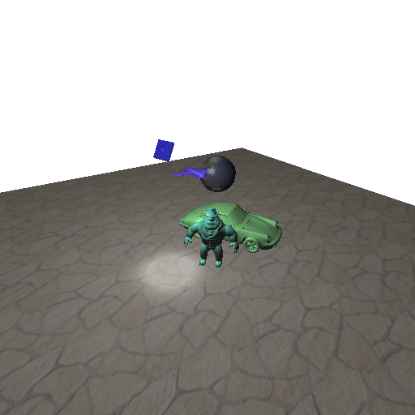
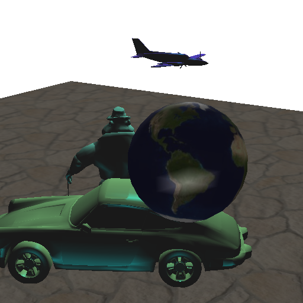
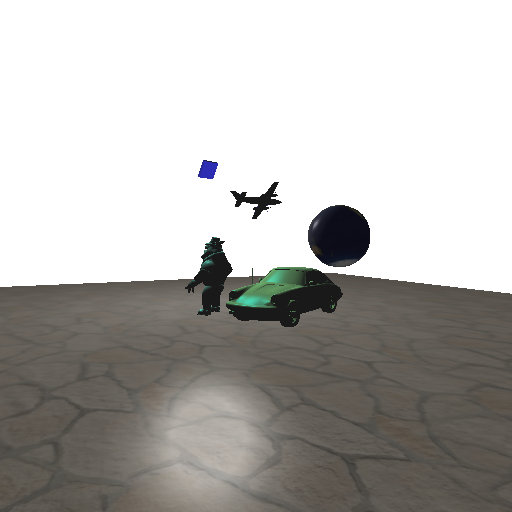
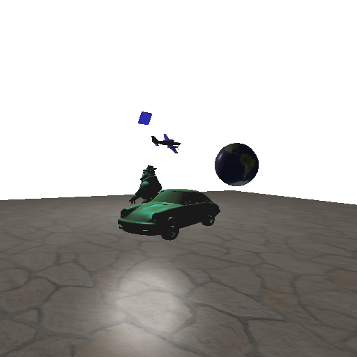

TP7: Light et Shadow Map
========================

## Auteur

 - Gaëtan DEFLANDRE

## Détails

Doit contenir :
 - ce que vous n'avez pas fait (et pourquoi).
 - difficultés rencontrées.
 - commentaires éventuels sur le TP (points à éclaircir, longueur du
   sujet, etc).

## Réponses

### Eclairement par vertex/éclairement par pixel

#### Question 2/3

On ne peut pas voir le halo spéculaire avec l'éclairement par vertex
car il faut le que la zone du halo soit sur un sommet pour que l'on
puisse le voir avoir l'interpolation. Or, comme le sol est constitué
de 4 sommets, il est rare de voir un effet de spécularité sur le
sol. Si l'on trouve le bon angle, on remarque bien l'interpolation.

Avec la planète aussi, on le remarque et cela ne donne pas un bonne
effet avec les mouvement de caméra.

Avec l'éclairement par pixel il n'y a plus ce problème car le calcul
de la spécularité est effectuée par pixel.

### Ombre par Depth Map

#### Question 1

L'image est fixe quand la caméra bouge car on utilise la même position
pour la position de la caméra
(`positionEye=modelviewMatrix*vec4(position,1);`) et pour la position
de texture (`gl_Position=mvp*vec4(position,1);`).

L'image de texture est dans le quart haut droit car les clip
coordinates sont entre -1 et 1 pour x, y, z alors que les texture
coordinates sont entre 0 et 1 pour x, y (pas de z car image 2D pour le
moment).

On ne voit pas la texture sur le fonc de la scène par il n'y pas
triangles dans le fond, pas de sommets et donc pas de pixels où
pourrait s'afficher la texture.

#### Question 5

Avec la ligne `fTexCoord=vec4(position,1);`, on donne la position dans
le repère local sans faire de changement de repère. Donc la texture
est fixe par rapport aux objets. Alors qu'avec les lignes:

    gl_Position=mvp*vec4(position,1);
    fTexCoord=gl_Position;

Il y a un changement de repère.

Ensuite, avec l'affectation `fTexCoord=positionEye;` l'image est
aligné avec la caméra, car on est dans le repère de celle-ci.
