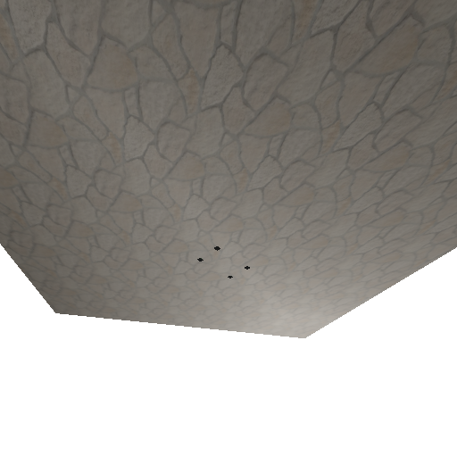

TP7: Light et Shadow Map
========================

## Auteur

 - Gaëtan DEFLANDRE

## Détails

Doit contenir :
 - ce que vous n'avez pas fait (et pourquoi).
 - difficultés rencontrées.
 - commentaires éventuels sur le TP (points à éclaircir, longueur du
   sujet, etc).

## Réponses

### Question 3

On ne peut pas voir le halo spéculaire avec l'éclairement par vertex
car il faut le que la zone du halo soit sur un sommet pour que l'on
puisse le voir avoir l'interpolation. Or, comme le sol est constitué
de 4 sommets, il est rare de voir un effet de spécularité sur le
sol. Si l'on trouve le bon angle, on remarque bien l'interpolation.

Avec l'éclairement par pixel il n'y a plus ce problème car le calcul
de la spécularité est effectuée par pixel.

