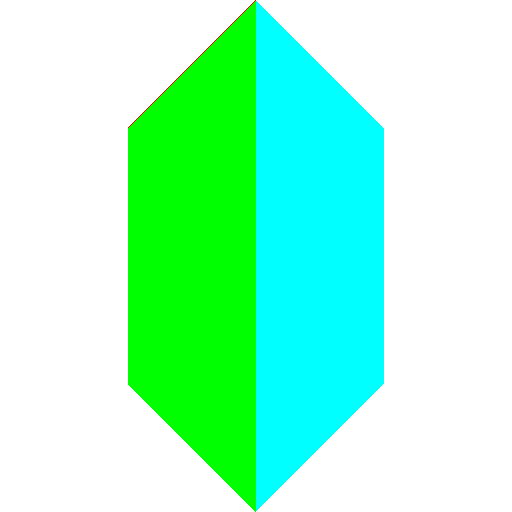
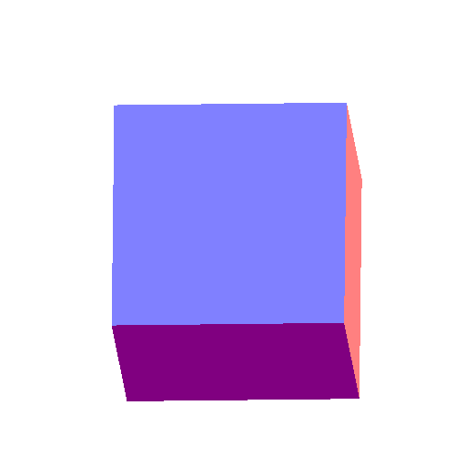
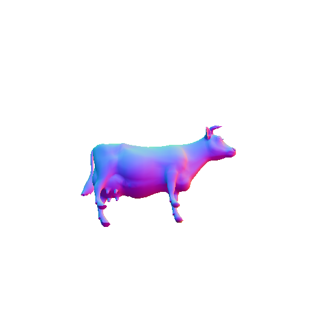
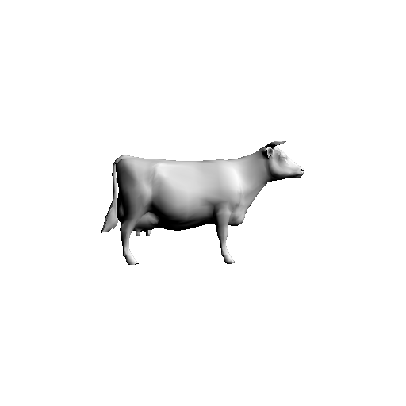
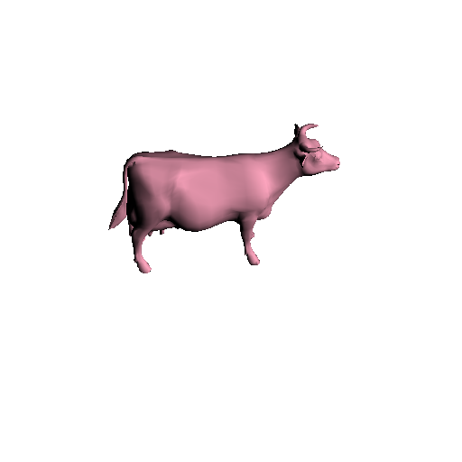
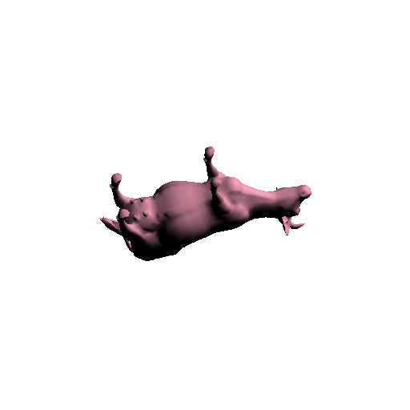

TP2: OpenGL
===========

## Auteur

 - Gaëtan DEFLANDRE
 
 
## Doit contenir :

 - ce que vous n'avez pas fait (et pourquoi).
   - test
 - difficultés rencontrées.
   - test
   
 - commentaires éventuels sur le TP (points à éclaircir, longueur du
   sujet, etc).

## Réponses

### Question 7

Sur la projection calculée par OpenGL, on peut voir la face cyan, une
partie de la verte et une autre de la face bleue. Les faces verte et
cyan sont à l'arrière du tétraèdre. Les faces rouge et bleu sont
devant les autres faces. La face rouge n'est pas visible alors qu'elle
fait partie des faces d'avant-plan.

En effet, si l'on ne précise rien à OpenGL, tous les fragments sont
tracé. Les derniers fragments sont tracés et la couleur du pixel tracé
remplace la précédente sans prendre en compte la profondeur. C'est le
cas dans notre exemple avec les faces verte, bleu et cyan.

### Question 8

### Question 9

 1. Avec le paramètre GL_GREATER pour la fonction glDepthFunc, on
    accepte les fragments si la valeur de leurs profondeurs est plus
    grande que celle déjà en mémoire pour la même coordonnée.

    Dans OpenGL la profondeur est calculée par rapport à la normale de
    la caméra. Si la profondeur d'un fragment vaut 1 alors il
    appartient au fond, si sa profondeur vaut 0 alors il est au plus
    proche de la caméra.

    Avec la ligne `glClearDepth(1);`, la profondeur de tous les
    fragments est initialisée à 1. Or les profondeurs des pixels des
    faces sont toutes inférieurs ou aux plus égaux à 1. Avec le paramètre
    GL_GREATER, les profondeurs des pixels sont toujours inférieures à
    celles déjà en mémoire et ne sont donc pas affichés (image
    blanche).

    Contrairement, le paramètre GL_LESS laisse passer les fragments
    dont la valeur de leurs profondeurs est inférieure à celle en
    mémoire pour la même coordonnée.

 2. Lorsqu'on donne 0 à la fonction glClearDepth, les pixels des faces
    peuvent maintenant être tracés. On observe les faces du fond, car
    elles ont une valeur de profondeur plus importante.

 3. Avec une valeur de 0.5, on voit les pixels qui se trouvent entre
    [0;1] sur l'axe des z. Par défaut, l'axe de la caméra est orienté
    sur l'axe des z. On retrouve tous les points dont la profondeur
    est supérieure à 0.5, c'est-à-dire ceux entre [0;1] sur l'axe Z,
    avec les coordonnées reportées.

    

### Question 18

### Question 19

### Question 20

Avec la méthode des Indexed Face Set, on perd toute la liberté sur les
couleurs et normales qui peuvent être différent pour deux sommets de
même position.

### Question 24

### Question 26

### Question 27 (Bonus)

#### Vertex shader

    // Q24 & 27: Normale

    // On passe les vecteurs des normales et de la source en vecteur 4.
    // Les vecteurs des normales et de la source ne sont pas des points,
	// mais des vecteurs, alors on met le w à 0
    float w = 0.0;
    vec4 N = vec4(normal,w);
    vec4 L = vec4(lightPosition,w);

    N = transform*N;

    N = normalize(N);
    L = normalize(L);

    float intensity = max(dot(N,L),0.0);

    fColor = intensity * diffuseColor;

