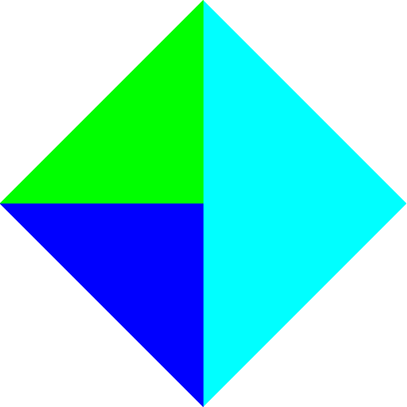
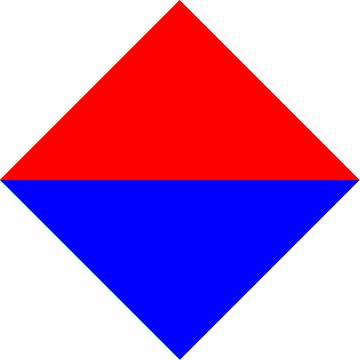

TP2: OpenGL
===========

## Auteur

 - Gaëtan DEFLANDRE
 
 
## Doit contenir :
- ce que vous n'avez pas fait (et pourquoi).
- difficultés rencontrées.
- commentaires éventuels sur le TP (points à éclaircir, longueur du
  sujet, etc).

## Réponses

### Question 7

Sur la projection calculer par OpenGL, on peut voir en plus des faces
rouge et bleu du premier plan (ce sont les seules visibles
normalement), on voit également les faces verte et cyan du tétraèdre.

En effet, si l'on ne prècis rien à OpenGL, tous les fragments sont
tracé. Les derniers fragments sont tracé et la couleur du pixel tracé
remplace la précédente sans prendre en compte la profondeur. C'est le
cas dans notre exemple avec les faces verte et cyan.

### Question 8

### Question 9

 1. Avec le paramètre GL_GREATER pour la fonction glDepthFunc, on
    accepte les fragments si la valeur de leurs profondeurs est plus
    grande que celle déjà en mémoire pour la même coordonnée.

    Dans OpenGL la profondeur est calculé par rapport à la normale de
    la caméra. Si la profondeur d'un fagment vaut 1 alors il
    appartient au fond, si sa profondeur vaut 0 alors il est au plus
    proche de la caméra.

    Avec la ligne `glClearDepth(1);`, la profondeur de tous les
    fragments est initilialisée à 1. Or la profondeur des pixels des
    faces sont tous inférieurs ou au plus égale à 1. Avec le paramètre
    GL_GREATER, les profondeurs des pixels sont toujours inférieurs à
    celle déjà en mémoire et ne sont donc pas affichés (image
    blanche).

    Contrairment, le paramètre GL_LESS laisse passer les fragments
    dont la valeur de leurs profondeurs est inférieur à celle en
    mémoire pour la même coordonnée.

 2. Lorsqu'on donne 0 à la fonction glClearDepth, les pixels des faces
    peuvent maintenant être tracées. On observe les faces du fond car
    elles ont une valeur de profondeur plus importante.
