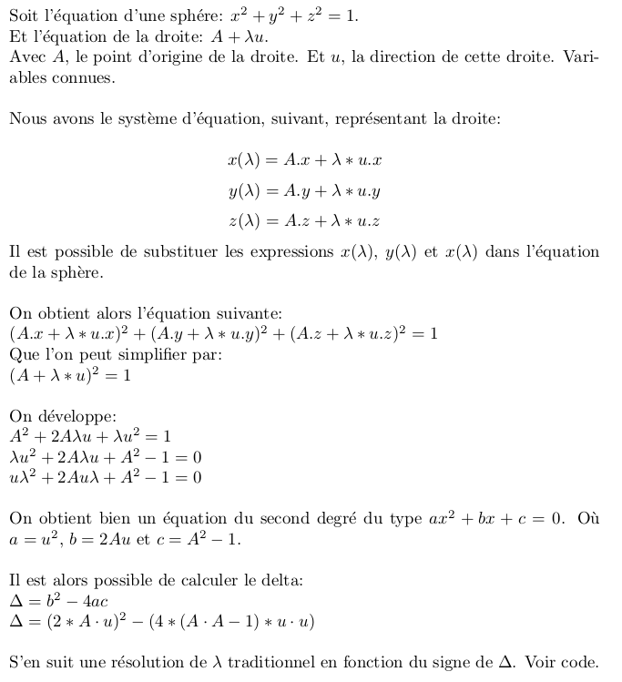

TP8: Lancer de rayons sur CSG
=============================

## Auteur

 - Gaëtan DEFLANDRE

## Détails

- ce que vous n'avez pas fait (et pourquoi).
  - Intégralité du TP terminé.

- difficultés rencontrées.
  - Les questions 1 des exercices 2 et 3 était particulièrement dure.
    J'aurais pas trouvé sans l'aide du professeur.

## Réponses

### Exercice 2: Quetion 1

