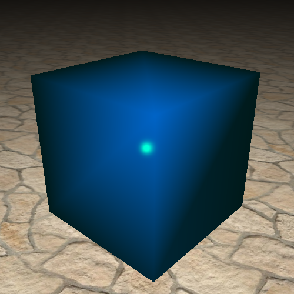
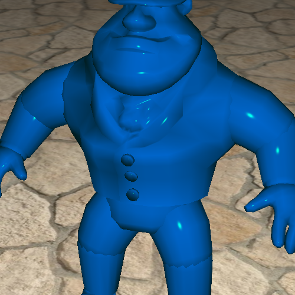

TP4: Winged
===========

## Auteur

 - DEFLANDRE Gaëtan
 

## Détails

 - Quelques difficultés pour comprendre le fonctionnement de
   Winged-Edges, même avec le cours.
 - TP complètement fini avec le bonus.

## Réponses aux question

### Question 3

Calculer la moyenne pour les normales permet de lisser les ombres.
Cette méthode fonctionne pour les objets avec beaucoup d'arrondis, et
permet de rendre invisibles les arêtes. Or, dans le cas du cube ou
d'objets avec des arêtes saillantes, on perd l'effet d'ombre bien
distincte qui délimite bien les faces (préférable dans le cas du
cube).

### Question 4

Pour le bonhomme, certaines arêtes sont des arêtes du bord et elles
n'ont qu'une face à gauche ou à droite. Il faut donc gérer les cas
NULL.

### Question 5

